class: font160

# Learning Goals for this Week


* Explain how ads are chosen to appear on a search engine site 
* Explain the similarities and differences between PSA ad and Ghost Ad experiments
* Explain the workings of the "Ghost Ad" methodology at an intuitive level
* Design an experiment to test the effectiveness of Search Engine Ads
* Interpret the results of an experiment that evaluates the effectiveness of search engine ads

---
class: inverse, center, middle

# Preliminaries

---
class: font160
# Where Are We Now? 

```{r, echo = FALSE, fig.align = "center", out.width="25%"}
url <- "https://png.pngtree.com/png-clipart/20211024/original/pngtree-pile-of-cartoonish-cute-doodle-theme-books-png-image_6871556.png"
knitr::include_graphics(url)
```

Course Themes:

1. **Measuring Advertising Effects**
  * `r icons:::icon_style(icons::fontawesome("check", style = "solid"), scale = 1)` Attribution Models
  * `r icons:::icon_style(icons::fontawesome("check", style = "solid"), scale = 1)` Media Mix Models
  * `r icons:::icon_style(icons::fontawesome("check", style = "solid"), scale = 1)` Field Experiment Basics
  * `r icons:::icon_style(icons::fontawesome("bullseye", style = "solid"), scale = 1)` Incrementality Experiments in Advertising
2. User Generated Content & Social Media

---
class: font160
# Our learning journey... 

.center[.font120[Popular techniques for estimating the incremental sales due to online advertising]]

*Previously*: Marketing Attribution Rules & Media Mix Modelling

* Relies on *observational* data 

*Last Time*: *Essentials of Field Experiments* 

* What are they? Why we run them? How to analyse the data?

**Today**: **Experiments in Online Advertising**

* Online Display Advertising
* Search Engine Advertising


---
# Wasteful Advertising Expenditures? 

```{r, echo = FALSE, fig.align = "center", out.width="100%"}
url <- "figs/wannamaker.png"
knitr::include_graphics(url)
```

.right[
Source: [Papergreat Blog](http://www.papergreat.com/2012/09/saturdays-postcard-wanamakers-and-1911.html)
]

---
class: font150
# Measuring Advertising Response

`r icons:::icon_style(icons::fontawesome("bullseye", style = "solid"), scale = 1)`
**The goal of any marketing campaign is to increase sales** 

* Either short-term or long-term

`r icons:::icon_style(icons::fontawesome("question", style = "solid"), scale = 1)`
**How to evaluate the performance of marketing?**

Each campaign / channel is evaluated on incremental profit that it produces relative to its cost 

$$
ROI = \frac{\text{incremental profit due to advertising} - \text{cost of advertising}}{\text{cost of advertising}}
$$

`r icons:::icon_style(icons::academicons("open-data"), scale = 1)` Our **challenge** so far: Estimating *incremental* revenue from advertising

---
class: font160
# The Business Problems

.center[`r icons:::icon_style(icons::fontawesome("bullseye", style = "solid"), scale = 1)`
*Seeking Answers to Strategic Questions:*]

* **How are online ads placed? How much do they cost?** 
  * Describe the AdWords ad placement process

**Are online display ads effective at increasing sales?**

* Methodologies: *Public Service Ads* & *Ghost Ads* $\rightarrow$ Field Experiments
* Discussion based on [Johnson, Lewis and Nubbemeyer (2017)](https://doi.org/10.1509/jmr.15.0297)

**Are search ads effective at increasing sales?**

* Methodology: Geo-Experiment
* Discussion based on [Nosko and Tadelis (2015)]( https://doi.org/10.3982/ECTA12423)

---
# What are Display Ads?

> A type of paid online advertising, display media consists of text, image, video, audio, and motion ads, which display on websites, apps, and social media platforms. These ads can appear in several sizes, including banner and reach users across the web.

```{r, echo = FALSE, fig.align = "center", out.width="100%"}
knitr::include_graphics("https://www.webfx.com/wp-content/uploads/2021/11/display-ad-example.png")
```

.font70[Source: [WebFX(2023)](https://www.webfx.com/digital-advertising/glossary/what-is-display-advertising/)]

---
# What are Search Engine Ads? 

```{r, echo = FALSE, fig.align = "center", out.width="100%"}
url <- "figs/organic_links.png"
knitr::include_graphics(url)
```

---
class: font130
# Difficulty is not always perceived!

.pull-left[
```{r, echo = FALSE, fig.align = "center", out.width="100%"}
knitr::include_graphics("https://upload.wikimedia.org/wikipedia/commons/thumb/4/44/Magid_Abraham_-_World_Economic_Forum_on_Latin_America_2009.jpg/1920px-Magid_Abraham_-_World_Economic_Forum_on_Latin_America_2009.jpg")
```

Magid M. Abraham, Co-Founder of ComScore
]

.pull-right[

"Measuring the online sales impact of an online ad or a paid-search campaign—in which a company pays to have its link appear at the top of a page of search results—is straightforward: We determine who has viewed the ad, then compare online purchases made by those who have and those who have not seen it."

M. Abraham, 2008. [Harvard Business Review](https://hbr.org/2008/04/the-offline-impact-of-online-a)

]

<br>

.center[
`r icons:::icon_style(icons::fontawesome("question", style = "solid"), scale = 1)`
**What's missing from this statement?**
]

---
class: inverse, center, middle
# How Are Ads Placed Online? How much do they Cost?

---
# Overview of the AdWords process

```{r, echo = FALSE, fig.align = "center", out.width="75%"}
url <- "figs/adwords_01_query.png"
knitr::include_graphics(url)
```

Remark: We'll discuss the process for a search engine ad.

* Process for display ads is very similar.

.right[
Source: [BarnRaisers LLC](https://barnraisersllc.com/2018/05/13/google-adwords-stats-marketing-strategy/)
]

---
# Overview of the AdWords process

```{r, echo = FALSE, fig.align = "center", out.width="75%"}
url <- "figs/adwords_02_keywords.png"
knitr::include_graphics(url)
```

.right[
Source: [BarnRaisers LLC](https://barnraisersllc.com/2018/05/13/google-adwords-stats-marketing-strategy/)
]

---
# Overview of the AdWords process

```{r, echo = FALSE, fig.align = "center", out.width="75%"}
url <- "figs/adwords_02_keywords.png"
knitr::include_graphics(url)
```

.right[
Source: [BarnRaisers LLC](https://barnraisersllc.com/2018/05/13/google-adwords-stats-marketing-strategy/)
]

---
# Overview of the AdWords process

```{r, echo = FALSE, fig.align = "center", out.width="75%"}
url <- "figs/adwords_03_ad_rank.png"
knitr::include_graphics(url)
```

.right[
Source: [BarnRaisers LLC](https://barnraisersllc.com/2018/05/13/google-adwords-stats-marketing-strategy/)
]

---
# Overview of the AdWords process

```{r, echo = FALSE, fig.align = "center", out.width="75%"}
url <- "figs/adwords_04_position.png"
knitr::include_graphics(url)
```

.right[
Source: [BarnRaisers LLC](https://barnraisersllc.com/2018/05/13/google-adwords-stats-marketing-strategy/)
]

---
# Overview of the AdWords process

```{r, echo = FALSE, fig.align = "center", out.width="75%"}
url <- "figs/adwords_05_payment.png"
knitr::include_graphics(url)
```

.right[
Source: [BarnRaisers LLC](https://barnraisersllc.com/2018/05/13/google-adwords-stats-marketing-strategy/)
]

---
class: font150
# Cost Per Click & Friends 

Three options for bids:

1. **Cost-per-click (CPC)** 
  * How much you pay when a user clicks on your ad.
2. **Cost-per-mille (CPM)** 
  * How much you pay per 1000 ad impressions.
3. **Cost-per-engagement (CPE)**
  * How much you pay when a user performs a specific action on your ad (signs up for a list, watch a video, etc).

Remark: 

*  Each of these are converted to a comparable number for the auction

---
class: inverse, center, middle

# Are Online Display Ads Effective?

---
# A Working Example

```{r, echo = FALSE, fig.align = "center", out.width="90%"}
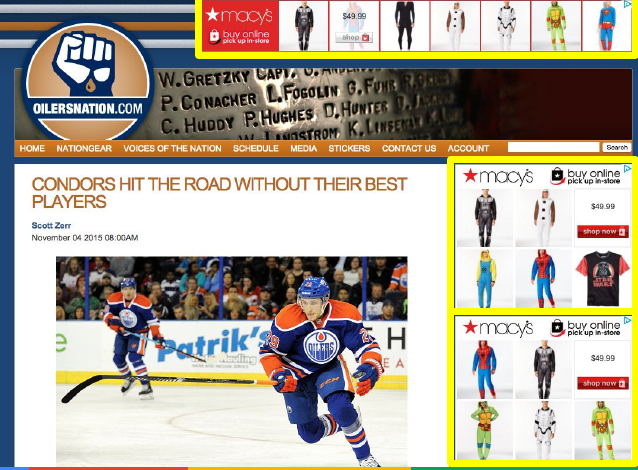
```


---
class: font160
# What is the right counterfactual? 

```{r, echo = FALSE, fig.align = "center", out.width="100%"}
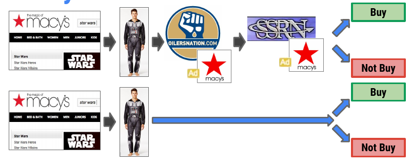
```

`r icons:::icon_style(icons::fontawesome("question", style = "solid"), scale = 1)`
Should we compare to:

* No Ads?
* A different sequence of Ads?
  * If so, which sequence?

---
class:font160
# What Ad to Show Instead? 

<br>

Two alternative sequences of ads have been studied:

1. **Public Service Ads**
  * Replace firm's ads with ads for NGO or charity
2.  An alternative "natural" sequence of ads
  * Called "**Ghost Ads**" in the literature

We'll talk through each methodology

---
class: font130
# Public Service Ads Experiment

```{r, echo = FALSE, fig.align = "center", out.width="90%"}
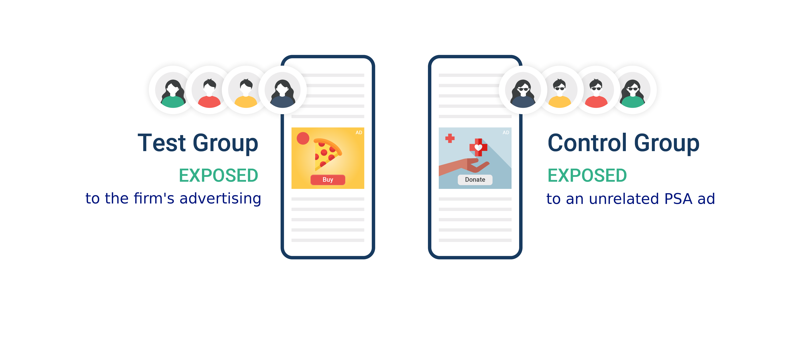
```

Randomised Control Trial (i.e. an Experiment) 

* Users are split into two groups: 
  * **Control condition**
      * Users sees public service announcement ads - ads that help raise social awareness
  * **Treatment** (aka Test) **condition** 
      * Users see the company's ad as usual

---
class: font120
# Public Service Ads Experiment

```{r, echo = FALSE, fig.align = "center", out.width="90%"}

```

**Main idea:** 

By serving these real, alternative ads, we obtain the information on which users would have been exposed to the company's ad if the experiment did not allocate them to see PSA ads.


**Remark**:

To show the PSA alternative, you have to win the auction and choose to serve a different ad!

---
# PSA Ads in Context 

```{r, echo = FALSE, fig.align = "center", out.width="100%"}
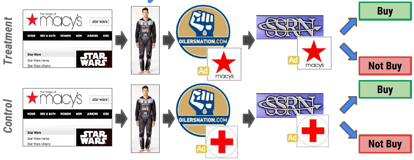
```

---
# The PSA Ad Sequence

```{r, echo = FALSE, fig.align = "center", out.width="100%"}
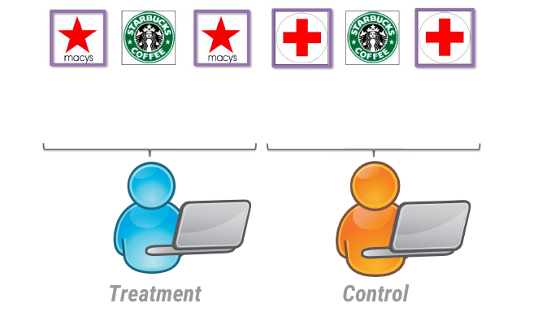
```

---
class: font140
# PSA Experiments are Costly!

```{r, echo = FALSE, fig.align = "center", out.width="90%"}
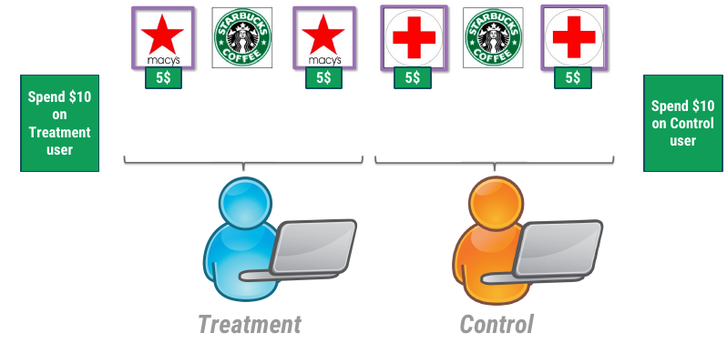
```

.center[
`r icons:::icon_style(icons::fontawesome("question", style = "solid"), scale = 1)`
Do I want to spend a significant portion of my budget on PSAs every time I run a campaign?
]

---
# PSAs are the WRONG Baseline

```{r, echo = FALSE, fig.align = "center", out.width="70%"}
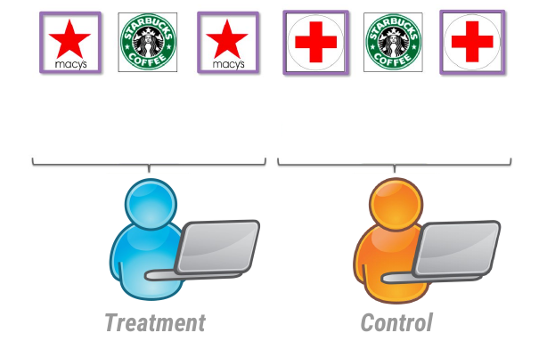
```

<br>

.center[
 Red Cross doesn't run PSAs to Macys target consumers when Macys stops its advertising. 
]

---
# PSAs are the WRONG Baseline

```{r, echo = FALSE, fig.align = "center", out.width="70%"}
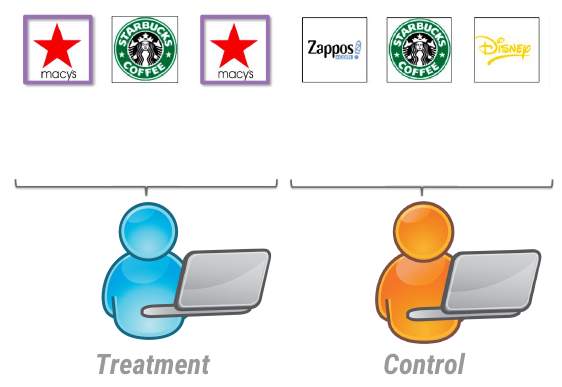
```

<br>

.center[
This Control group reflects advertiser's true strategic environment
]

---
# Towards a Solution: Ad Logs

```{r, echo = FALSE, fig.align = "center", out.width="100%"}
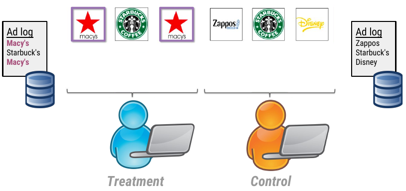
```

---
class: font130
# Ghost Ads

```{r, echo = FALSE, fig.align = "center", out.width="70%"}
url <- "https://www.ama.org/wp-content/uploads/2019/01/ghost-ads-image.jpg?resize=1170%2C550"
knitr::include_graphics(url)
```

**Ghost Ads**: Identify ads among control group that *would have been* treatment ads *if* user was in treatment group

* **Treatment group**: user who see **your company's ad** (Macy's in this example)
* **Control group**: user sees **whatever ad platform chooses to deliver**

---
# Ghost Ads: Implementation

```{r, echo = FALSE, fig.align = "center", out.width="120%"}
url <- "figs/ghost_ads_flow.png"
knitr::include_graphics(url)
```

<br>

.center[
**Analysis**: Compare behaviour of users in treatment and control group
]

---
# Ghost Ads: Identifying

```{r, echo = FALSE, fig.align = "center", out.width="70%"}
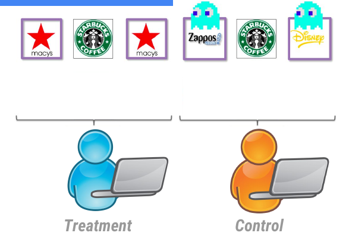
```

<br>

.center[

Control users would have seen Macy's ads: Log the ads!

]

---
# Ghost Ads: Logging

```{r, echo = FALSE, fig.align = "center", out.width="100%"}
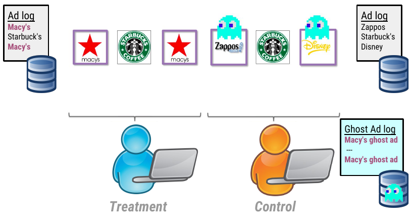
```

---
# Ghost Ads: Logging

```{r, echo = FALSE, fig.align = "center", out.width="100%"}
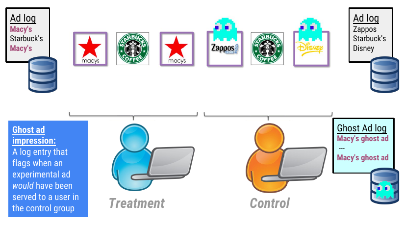
```

---
class: font160
# Ghost Ads in Practice

```{r, echo = FALSE, fig.align = "center", out.width="40%"}
url <- "https://image4.owler.com/logo/defshop-kg_owler_20170831_121955_large.jpg"
knitr::include_graphics(url)
```

```{r, echo = FALSE, fig.align = "center", out.width="50%"}
url <- "https://fashionunited.com/cdn-cgi/image/fit=cover,format=auto,gravity=center,height=463,quality=70,width=694/https://fashionunited.com/img/upload/2021/12/13/dscf6354-defshop-koeln11-1-dw3cwbas-2021-12-13.jpeg
"
knitr::include_graphics(url)
```

**Case Study**: Def Shop 

* An online platform that allows users to shop for hip-hop clothing, footwear and accessories.

.font70[[FashionUnited.de (2021)](https://fashionunited.de/nachrichten/business/defshop-ceo-franco-luca-die-planungssicherheit-vor-corona-gibt-es-nicht-mehr/2021121344238)]

---
class: font160
# The DefShop Experiment 

Motivation:  

> "We're a family business ... we're naturally forced to double-check every cent we invest. For us it's about ... being as profitable as possible."

In the Ad marketplace: 

> "going from having only a feeling of what our ads might be driving to actually knowing their direct impact. And knowing is a much better feeling!" 

---
class: font160
# DefShop Experiment Details 

**Customer Segment**: Product and Cart Abandoners 


```{r, echo = FALSE, fig.align = "center", out.width="60%"}
url <- "https://www.vpcart.com/images/blog/Cart-Abandonment-2.png"
knitr::include_graphics(url)
```

.font70[Source: [VP Cart (2019)](https://www.vpcart.com/blog/abandoned-cart/)]


---
class: clear

```{r, echo = FALSE, fig.align = "center", out.width="50%"}
url <- "https://koronapos.com/wp-content/uploads/2019/07/942097_2-New-Infographs_2_011221.png.webp"
knitr::include_graphics(url)
```

.font70[Source: [Korona Pos (2021)](https://koronapos.com/blog/reasons-for-abandoned-carts/)]

---
class: font140
# DefShop Experiment: Results

```{r, echo = FALSE, fig.align = "center", out.width="66%"}
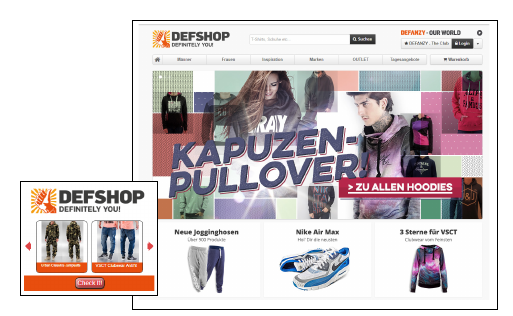
```

Experiment Duration: 3 weeks

**Outcomes**:

* **Purchases**: increase by 12%
* **Site Visits**: increase by 23%
* **Brand Search Queries**: increase by 38%

---
class: font160
# Takeaways 

<br>

* Measuring display ad effectiveness is difficult

* Two experimental paradigms to measure casual effects:
  * Public Service Ads (PSAs)
  * Ghost Ads 

* Ghost Ads overcome the shortcomings from PSAs 

---
class: inverse, center, middle

# Are Search Engine Ads Effective?

---
class: font150
# Search Engines Matter!

**Consumers use search engines**:

* 53% of all organic web traffic comes via search engines
* 32% of all traffic goes to first ranked page
* 91% of webpages get ZERO web traffic from Google
* 40% of purchases influenced by relevant search

**Firms respond**:

* Approx. US$100 billion spent on search ads in the US in 2022
  * This is almost 40 percent of all digital ad spending in the US

.pull-right[
.font70[
Source: [Search Engine Journal](https://www.searchenginejournal.com/seo-guide/seo-statistics/), [Statista](https://www.statista.com/topics/4312/search-advertising/#topicOverview)
<!--- https://www.searchenginejournal.com/seo-guide/seo-statistics/#close--->
]
]


---
# Search Engine Ads - Google 


```{r, echo = FALSE, fig.align = "center", out.width="70%"}
url <- "figs/google_sem.png"
knitr::include_graphics(url)
```

---
# Search Engine Ads - Amazon 

```{r, echo = FALSE, fig.align = "center", out.width="60%"}
url <- "figs/amazon_sem.png"
knitr::include_graphics(url)
```

---
# Search Engine Ads - Yelp

```{r, echo = FALSE, fig.align = "center", out.width="55%"}
url <- "figs/yelp_sem.png"
knitr::include_graphics(url)
```

---
class: font160
# Are Paid Search Ads Effective?

**Motivation**: Is Search Engine Marketing Effective?

**Specific Questions**: 

* Does SEM generate a positive Return on Investment?
* Is SEM an informative or persuasive form of advertsing?

**How?**

* Geo-Experiments at eBay

Discussion below draws from [Blake, Nosko and Tadelis](https://doi.org/10.3982/ECTA12423)

---
# Paid Search Ads - The 2012 edition

```{r, echo = FALSE, fig.align = "center", out.width="100%"}
url <- "figs/google_sem_nosko.png"
knitr::include_graphics(url)
```

---
class: font160
# Brand Search Terms Experiment

**Brand Terms**: any queries that include the name of the brand 

* Examples: 'ebay shoes', 'de bijenkorf dress',

*Hypothesis*: Users who type the brand name intend to go to that site anyway 

$\implies$ brand ads are intercepting what would otherwise be organic clicks

*Experiments*: 

* Experiment 1 (March to June 2012): Shutdown brand ads on MSN and Yahoo!
* Experiment 2 (July 2012): Shutdown brand ads on Google 

---
class: font160
# Brand Search Terms Eyeconometrics


```{r, echo = FALSE, fig.align = "center", out.width="100%"}
url <- "figs/branded_search_fig.png"
knitr::include_graphics(url)
```

* 99.5 % of click traffic is retained!

---
class: font160
# Non-Brand Search Terms

**Non-Brand Search terms**: queries that do not include the name of the brand 

* Examples: 'shoes', 'long dress'

**Key difference**: Users might not know product is available at a advertiser's website

*Hypothesis*: Non brand ads steer consumers to advertiser's site 

*Experiment*: Large scale *Geo* Experiment

* Suspend non-brand ads in 30% of all DMAs in USA 
* Control vs Test Split chosen via an algorithm
* DMA: region of the US, roughly equivalent to a metro area

---
class: font160
# Analyzing Experiments Redux

**How to analyze this data?**: Treatment and Control units might differ systematically 

* i.e. average behaviour might differ

<br>

|                     | Before | After |
|---------------------|--------|-------|
| **Control Group**             | $\beta_0$      |  $\beta_0 + \beta_1$     |
| **Treatment Group**           | $\beta_0 + \beta_2$       |   $\beta_0 + \beta_2 + \beta_1 + \delta$    |

$\delta$ is the effect of the experiment 

.center[
`r icons:::icon_style(icons::fontawesome("question", style = "solid"), scale = 1)`
**How can we recover it?**
]

---
class: font150 
# Estimating the Treatment Effect

|                     | Before | After | After - Before |
|---------------------|--------|-------|----------------|
| **Control Group**             | $\beta_0$      |  $\beta_0 + \beta_1$     |    $\beta_1$            |
| **Treatment Group**           | $\beta_0 + \beta_2$       |   $\beta_0 + \beta_2 + \beta_1 + \delta$    |  $\beta_1 + \delta$               |
| **Treatment - Control** | |  |    $\delta$            |

<br>

$\implies$ We can estimate the **average treatment effect**

**Assumption**: Parallel trends 

* if Treatment Group did not receive treaIment, average would also have increased by $\beta_1$

$\rightarrow$ This is *crucial* and *untestable*

---
class: font160 
# Estimating the Treatment Effect

<br>

|                     | Before | After | After - Before |
|---------------------|--------|-------|----------------|
| **Control Group**             | $\beta_0$      |  $\beta_0 + \beta_1$     |    $\beta_1$            |
| **Treatment Group**           | $\beta_0 + \beta_2$       |   $\beta_0 + \beta_2 + \beta_1 + \delta$    |  $\beta_1 + \delta$               |
| **Treatment - Control** | |  |    $\delta$            |

<br>

Can recover $\delta$ via a regression:

$$
\begin{align*}
y_{it} = \beta_0 &+ \beta_1 After_{t }+ \beta_2 TreatmentGroup_{i} + \\
                 &\delta \, TreatmentGroup_{i} \, \times \, After_{t} + \varepsilon_{it}
\end{align*}
$$


---
# Non-Brand Search Terms Eyeconometrics

```{r, echo = FALSE, fig.align = "center", out.width="100%"}
url <- "figs/nonbranded_search_fig.png"
knitr::include_graphics(url)
```

---
class: font150
# Non-Brand Search Terms Econometrics 

**Method**: Difference in Differences

$$
\begin{aligned}
\ln(\text{Sales}_{it}) = \beta_0 &+ \beta_1 \text{Treatment Group}_i + \beta_2 {Post}_t \\
  & + \delta \text{Treatment Group}_i \times {Post}_t + \text{Fixed Effects} + \varepsilon_{it}
\end{aligned}
$$

* $i$ is a DMA (region) of the US 
* $t$ is time (calendar date)

**Coefficient of Interest**: $\delta$ 

`r icons:::icon_style(icons::fontawesome("question", style = "solid"), scale = 1)`
**Discussion Questions**:

* Why is $\delta$ the coefficient of interest?
* How to Interpret?

*Note*: Authors only report $\delta$ in their results tables 

---
# Non Brand Search Terms Results 

```{r, echo = FALSE, fig.align = "center", out.width="90%"}
url <- "figs/nonbranded_search_table.png"
knitr::include_graphics(url)
```

---
# Consumer Heterogeneity 

```{r, echo = FALSE, fig.align = "center", out.width="90%"}
url <- "figs/heterogeniety.png"
knitr::include_graphics(url)
```

---
class: font160
# Main Takeaways 

* Ads served via **Brand Search terms** are, **on average**, **ineffective** at bringing clicks to site 
* Ads served via **Non-Brand Search terms** are, **on average**, **do not generate sales** 
* **Non-Brand Search terms** **might be** effective for:
  * Consumers who **do not purchase frequently** on site 
  * Consumers who **haven't purchased in a long time**

Results are suggestive of Search Engine Ads being **informative**

`r icons:::icon_style(icons::fontawesome("question", style = "solid"), scale = 1)`
**Discussion Q:** 

* Are the consumers for whom ads might be effective usually the type of consumers a firm would advertise to?

---
class: font160
# Generalizability of Results?

How **generalizable** are the eBay results across different companies? 

* [Coviello, Gneezy and Goette (2017)](https://www.econstor.eu/bitstream/10419/171148/1/cesifo1_wp6684.pdf) run the same experiments for a 'more representative company'
  * Company: [Edmunds](https://www.edmunds.com/)  
  * Experiment: Shutdown branded keyword ads on Yahoo and Bing
    * Split markets into 'Treatment' and 'Control'
  * Analysis: Difference in Differences 

---
class: font160
# Generalizability of Results?

```{r, echo = FALSE, fig.align = "center", out.width="90%"}
url <- "figs/ebay_generalizability.png"
knitr::include_graphics(url)
```

Result: **5.6 percentage point reduction in total traffic**

$\implies$ search engine ads are not a "zero" effect for all firms


---
class: inverse, center, middle

# Recap

---
class: font140
# Summary

**How Are Search Engine Ads placed?**

* Displayed Search Engine Ads are the result of an auction between competing advertisers 
* Ad Ranks in auctions are the combination of a cost (per click) and a quality score 
* Ad prices are a function of the 2nd best bid's price and the winner's quality score

**Are Online Display Ads Effective?**

* Ghost Ads presents an experimental framework to study causal effects of online display ads 
  * Creates a log entry where an ad wins an auction but shows the second ad 
  * i.e. a competitor in the ad auction 
  * Which is a "better" control group than serving PSA ads

---
class: font140
# Summary

**Are Search Engine Ads Effective?**

* Evidence from experiments run by Ebay suggest on average search engine ads have a negative return on investment 
* ... Because on average they don't generate additional sales 
* But this effect might not be true for all firms 
  * We need more evidence ...

---
class: font150
# Most Experiments Fail

**Main point of an experiment**:  test some idea 

* *not* proving something 

$\implies$ most experiments "fail"

* i.e. change does not lead to an improvement

**This is a good thing**

* Bad ideas fail quickly
* Investment is typically small ...
* ... as are the sample sizes

But failed experiments are not normally what one sees ...

* In publications, or 
* When talking to a firm 


---
# License & Citation

Suggested Citation:

```{r, engine='out', eval = FALSE}
@misc{deerdsms2024,
      title={"Digital and Social Media Strategies: Incrementality Experiments
               in Advertising"},
      author={Lachlan Deer},
      year={2024},
      url = "https://github.com/deer-marketing-lab/dsms-lecture-ad-experiments"
}
```

<p style="text-align:center;"></p>

This course adheres to the principles of the Open Science Community of Tilburg University. 
This initiative advocates for transparency and accessibility in research and teaching to all levels of society and thus creating more accountability and impact.

<p style="text-align:center;"></p>
This work is licensed under a <a rel="license" href="http://creativecommons.org/licenses/by-sa/4.0/">Creative Commons Attribution-ShareAlike 4.0 International License</a>.